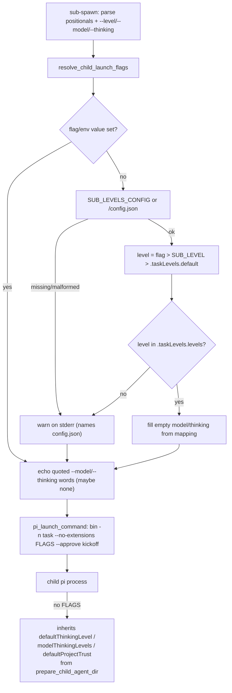

# Design: per-task difficulty levels for child model and thinking (sub-spawn)

## Summary

The orchestrator evaluates a task's difficulty when it writes the brief and
passes one of three levels to the spawn; the level maps to the child's
model and thinking level. The mapping is **configuration, not code**: it
lives in `config.json` at the repository root — a generic, root-level
configuration file namespaced under the `taskLevels` top-level section so
future general settings can sit beside it. The concrete levels and their
model/thinking pairs live in that file alone; this document describes the
shape of the mapping, not the shipped values.

Retuning the trade-off (e.g. moving a model, changing a thinking cap) is a
JSON edit, no script change.

Resolution precedence, implemented by `resolve_child_launch_flags()` in
`scripts/_sub-common.sh`:

```
model/thinking = --model/--thinking flag  >  SUB_MODEL/SUB_THINKING env
                 >  level mapping in the config
level          = --level flag  >  SUB_LEVEL env  >  .taskLevels.default
config path    = SUB_LEVELS_CONFIG env  >  <repo>/config.json
```

`config.json` is a **generic root-level file**: its top level may hold any
number of sibling sections. Level resolution addresses only
`.taskLevels.*`; unknown sibling keys are ignored by construction (every jq
query is rooted at `.taskLevels`), so a future general setting added to
`config.json` can never break a spawn. Shape validation likewise targets
`.taskLevels.levels` only.

Every failure mode degrades to **no flags** — the child then inherits
`defaultThinkingLevel` / `modelThinkingLevels` / `defaultProjectTrust` from
the global pi settings, which `prepare_child_agent_dir` now inherits (the
one-line key-set extension of the mechanism introduced by
`specs/child-model-defaults`). Nothing in the resolution path may break
spawning: missing file, unknown level, malformed JSON all warn on stderr,
exit 0, and print nothing.

## Entities

- **`config.json`** (new, repo root) — generic root-level config; the levels
  live in the `taskLevels` section:
  `{"taskLevels": {default, levels: {<name>:
  {description, model, thinking}}}}`; the shipped levels live in the file.
  Sibling top-level keys are reserved for future general settings and are
  ignored by level resolution. Local to this repository by requirement;
  overridable per environment via `SUB_LEVELS_CONFIG`.
- **`scripts/_sub-common.sh`** (modified):
  - `_SUB_COMMON_DIR` — script's own dir, anchors the default config path;
  - `resolve_child_launch_flags <level> <model> <thinking>` — the precedence
    walk above; echoes already-`%q`-quoted option words (possibly empty),
    warns via `warn()` to stderr (messages name `config.json`), always exits 0;
  - `pi_launch_command <bin> <task> <flags> <kickoff>` — assembles the child
    launch line; with flags it is
    `bin -n task --no-extensions --model … --thinking … --approve kickoff`,
    i.e. options stay **before** the kickoff positional so pi parses them as
    options, not prompt text;
  - `prepare_child_agent_dir` — `model_cfg` jq gains
    `defaultThinkingLevel`, `modelThinkingLevels`, `defaultProjectTrust`
    (nulls still dropped, all defensive fallbacks unchanged).
- **`scripts/sub-spawn.sh`** (modified) — parses `--level <name>`,
  `--model <pattern>`, `--thinking <level>` anywhere after the script name
  (interleaved with the three positionals; unknown options die), resolves
  the flags immediately after parsing (so warnings precede any work), passes
  them through `pi_launch_command`, and prints the resolved launch options
  in the spawn handles. Usage line updated.
- **`specs/child-task-levels/`** (new) — this design + the feature file.
- **`tests/task-levels.test.sh`** (new) — one test per scenario
  [REQ-2]…[REQ-12]; hermetic (fixture configs via `SUB_LEVELS_CONFIG`,
  fixture `$HOME` for the inheritance test, env overrides cleared with
  `env -u`). The shipped root `config.json` is never the subject under test.
- **`AGENTS.md`** — "Child model and thinking levels" subsection: the rubric
  for picking a level, the spawn syntax, and the override knobs.

## Behaviour and data flow



## Proposed changes (files/modules)

| File | Change |
|---|---|
| `config.json` (repo root) | new — `taskLevels` section: the levels + `default`; sibling top-level keys left free for future settings |
| `scripts/_sub-common.sh` | `_SUB_COMMON_DIR`, `resolve_child_launch_flags`, `pi_launch_command`, thinking/trust keys in `model_cfg` |
| `scripts/sub-spawn.sh` | flag parsing, resolution call, launch-line builder, handles line, usage/comment updates |
| `specs/child-task-levels/*` | feature file + this design |
| `tests/task-levels.test.sh` | behavioural suite, one test per scenario |
| `AGENTS.md` | "Child model and thinking levels" subsection |

## Task list

- [x] Deduce atomic requirements from the brief → [REQ-1]…[REQ-11]
- [x] Write the feature file and this design doc
- [x] RED: run the new suite against the pre-change implementation
- [x] GREEN: full suite (`task-levels`, `sub-common`) + shellcheck + `bash -n` pass
- [x] Generic-config refactor: root `config.json`, `taskLevels` namespace,
      [REQ-12] (unknown sibling top-level keys ignored), warnings name
      `config.json`
- [x] Note: `specs/child-model-defaults` speaks of "the three model keys";
      its set now extends to six (three model defaults +
      `defaultThinkingLevel`, `modelThinkingLevels`, `defaultProjectTrust`).
      Its feature file and tests stay valid (its fixtures declare none of the
      new keys) — the superset behaviour is asserted here under [REQ-8].

## Strengths / Weaknesses

- **Strengths**: difficulty tuning is a JSON edit; every degradation path
  converges on "inherit from global settings", so spawning never breaks;
  the resolver is a pure function (testable without tmux/treehouse); flag
  parsing rejects typos before any resource is touched; `config.json` is
  generic from day one — future general settings are additive top-level
  keys, requiring no change to the level-resolution code (asserted by
  [REQ-12]).
- **Weaknesses**: `sub-spawn.sh`'s flag parsing itself is only covered by
  the [REQ-10] bad-invocation smoke tests (happy-path wiring is asserted at
  the `pi_launch_command` level, not end-to-end — a real spawn would lease a
  worktree); the config path convention (`config.json` at the repo root,
  resolved relative to `_SUB_COMMON_DIR/../`) is implicit in `_SUB_COMMON_DIR`,
  so moving the scripts dir silently changes the default path (mitigated by
  `SUB_LEVELS_CONFIG`); the `taskLevels` namespace is hardcoded in the jq
  queries — renaming the section is a code change, though adding sibling
  settings is not.

## Code audit (post-refactor, independent pass)

Audited per the `codebase-design` deep-module vocabulary: the resolver was
read from disk alongside the feature file, without the conversational
rationale.

- **Overview**: `resolve_child_launch_flags` is a deep module — a small
  interface (three optional positional args + `SUB_*` env + one config-path
  hook) hides the whole precedence walk, four degradation paths, and shell
  quoting. Tests cross exactly that interface, which is the right seam.
  The generic-config refactor widened no interface: only the jq roots moved
  (`.levels` → `.taskLevels.levels`), so [REQ-1]…[REQ-12] remained 12 tests
  over the same seam.
- **Files**: `scripts/_sub-common.sh` (`levels_config`,
  `resolve_child_launch_flags`, `pi_launch_command`), `scripts/sub-spawn.sh`
  (flag parsing, launch call), `config.json`.
- **Problem / Solution / Benefits**: no major improvement found; nothing to
  refactor beyond what the refactor already did.
- **Less valuable improvements** (noted, deliberately not done):
  1. The four sequential `jq` calls re-parse `config.json` on every spawn —
     a single `jq` invocation returning all three values would do. *Speculative*:
     spawn happens once per task; readability of the stepwise degradation
     warnings wins.
  2. The `taskLevels` namespace literal is repeated in five jq queries —
     binding it once (`--arg ns`) would localize a section rename. *Worth
     exploring* only if a second namespaced section ever appears; today it
     is locality-in-one-function already.
  3. `sub-spawn.sh`'s happy-path flag wiring remains covered indirectly
     (existing weakness, unchanged by the refactor).
- **Recommendation strength**: Speculative for all three; audit verdict —
  no architectural friction detected, ship it.

## Change: document/config-content assertions removed (2026-10-03)

User directive: tests never assert the contents of a document or a config
file. The suite used to read the shipped `config.json` through
`TASK_LEVELS_CONFIG_UNDER_TEST` and pin its `standard` echo ([REQ-1]) plus
the shipped `easy`/`hard`/`default` mappings ([REQ-2]…[REQ-4]) — all red
once the shipped config was retuned.

- [REQ-1] scenario + test removed (it asserted a shipped config value).
- [REQ-2]…[REQ-4] scenarios reworded to *a fixture config*; their tests now
  pass `SUB_LEVELS_CONFIG="$SCRATCH/levels.json"`. The resolver behaviour
  (named-level selection, flag/model precedence, env precedence) is unchanged
  and still covered.
- The suite no longer reads the shipped root `config.json` at all.

Disposition recorded in `specs/no-doc-config-tests/no-doc-config-tests-design.md`.
