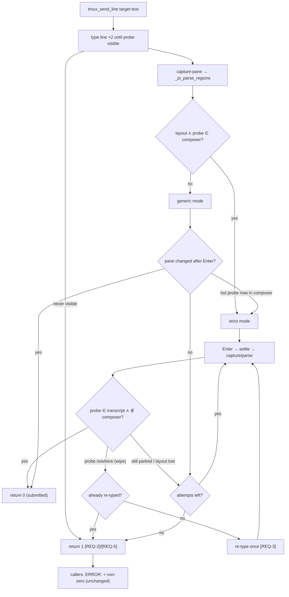

# Design: evidence-based prompt submission (tmux_send_line)

## Abstract

`tmux_send_line` (`scripts/_sub-common.sh`) currently proves a send by "the
pane content changed after an Enter" — correlation, not submission. A new
pane-region parser splits one `capture-pane` of a pi TUI into **composer**
(lines directly above the status border) and **transcript** (everything
above), and `tmux_send_line` demands positive evidence inside pi panes: the
line left the composer *and* appears in the transcript. Panes without pi's
layout (shell launch panes of `start-main.sh` / `sub-spawn.sh`) keep the
existing change-based confirmation. Unconfirmed sends return 1 exactly as
before, so every caller's loud-failure contract is preserved untouched.

## Observed pane anatomy (empirically verified, 2026-10-02)

Bottom-up, identical across idle, busy, short (h=12) and wide (w=80) panes:

```
… transcript lines
  (blank gap)
  spinner row        ──── idle │ ── ⠹ Working ──… busy
  composer           (blank when empty │ parked text otherwise)
  status border      ────────────────
  path line          ~… (task/…)
  stats line         ↑… ↓… R… CH… $… model • level   ← last line
```

- **Parked**: the unsent line sits in the composer block, directly above the
  status border; the transcript fold above does not grow.
- **Submitted**: the composer line goes blank and the line appears verbatim
  (leading space, wrapped) in the transcript; the spinner row shows
  `Working`. Verified for plain prompts and slash commands (`/help`,
  `/model`), for 700+ char lines (full text including the *tail* renders),
  and while busy.

## Entities

- **`scripts/_sub-common.sh`** (modified)
  - `_pi_parse_regions` (new): reads a pane capture on stdin, sets
    `_pi_layout` (1 = pi's status-border layout found within 6 lines above
    the last non-empty line), `_pi_comp` (flattened contiguous non-blank
    block directly above the border = composer; absorbed spinner row when
    parked), `_pi_trans` (flattened everything above that block), and
    `_pi_all` (flattened whole capture). Pure stdin→globals: unit-testable
    without tmux.
  - `_pi_regions_of` (new): captures the pane and parses it; clears the
    globals when the capture fails (target gone) so stale evidence can
    never confirm a send.
  - `tmux_send_line` (modified): same signature and return contract
    (`0` confirmed, `1` not confirmed).
    1. Type the line until visible (unchanged, 2 attempts) — but now a text
       that never appears returns 1 immediately instead of falling through
       to the Enter loop ([REQ-4]).
    2. Decide/track mode: inside pi's composer (layout recognized ∧ probe in
       `_pi_comp`) ⇒ **strict**; re-evaluated every poll so a pane that
       turns out to be a pi composer can never be confirmed generically.
    3. Per attempt: one capture → parse →
       - strict: success **only** on `probe ∈ transcript ∧ probe ∉ composer`;
         `probe` nowhere on screen (layout recognized) = wipe → re-type once
         ([REQ-3]), a second wipe or exhausted attempts ⇒ return 1;
         otherwise (parked / layout momentarily unrecognized) retry Enter
         ([REQ-2], [REQ-5]).
       - generic: the legacy "content changed after Enter" check, guarded by
         the composer re-check ([REQ-6]).
  - Probe stays the flattened **tail** (last 60 chars; the whole line when
    shorter — bash's `${var: -60}` is empty for short strings, a latent bug
    in the old helper that made every short probe vacuous): the composer and
    the just-submitted transcript line are bottom-anchored, so the tail is
    the part guaranteed on screen even for messages longer than the pane.
- **`scripts/sub-send.sh` / `sub-report.sh` / `sub-spawn.sh` /
  `sub-fallback.sh` / `start-main.sh`** (call sites only, unchanged): they
  already treat a non-zero status as fatal ([REQ-8]); their comments gain no
  behaviour change beyond what the helper enforces.
- **`AGENTS.md`** (modified): the tmux_send_line sentence in "Every prompt
  must be confirmed as submitted" now describes the evidence rule and the
  loud failure. (The former [REQ-9] test that grepped this wording was
  removed on 2026-10-03: tests never assert document contents.)
- **`specs/fix-send-confirm/`** (new): this design + the feature file.
- **`tests/sub-common.test.sh`** (extended): fixture-capture tests for
  `_pi_parse_regions` and behaviour tests for `tmux_send_line` against a
  stateful fake tmux with a structured pi pane (modes incl. `redraw` — the
  incident — `vanish`, `shell`).
- **`tests/sub-report.test.sh`** (extended): the fake pane gains the same
  structure plus a `redraw` mode; one end-to-end scenario proves
  `sub-send.sh` cannot print "instruction sent" for a parked prompt
  ([REQ-2]/[REQ-5]).

## Data flow



## Plan / proposed changes

1. `_pi_parse_regions` + `_pi_regions_of` (pure parsing seam, no tmux calls
   in the parser) — unit-tested from fixture captures taken from live panes.
2. `tmux_send_line`: evidence-driven state machine described above; docstring
   rewritten to the new contract; timing budget stays bounded
   (2×0.4 s typing + attempts×settle + one 0.2 s vanish re-check).
3. `AGENTS.md`: one-paragraph wording update in step 4.
4. Tests: extend `tests/sub-common.test.sh` (parser fixtures + helper
   behaviour) and `tests/sub-report.test.sh` (structured fake pane + incident
   regression); existing suites must stay green unchanged
   (`sub-report`, `free-limit-fallback`, `test-start-main`, `task-levels`…).

## Best practices

- **Evidence, not elapsed time**: every success claim maps to a rendered
  fact (line in transcript, line out of composer); sleeps only bound polls.
- **Fail-safe direction**: every detection gap (layout unrecognized, probe
  ambiguous, capture failing) degrades to *no evidence* → retry → loud
  failure, never to a false success.
- **One capture per poll**, parsed once; byte-safe literal string handling
  (no awk multibyte pitfalls — the system awk is mawk).
- Minimal surface: only the shared helper and its docstring change; call
  sites, return codes, and success wording are untouched.

## Root cause (field incidents 2026-10-02 #1–#3 + pi source + reproduction)

The old success condition — *the pane content changed after an Enter* —
correlates a redraw with a submission. Three field incidents proved pi's
composer mutates **without** submitting:

| # | time (Asia/Bangkok) | target | fingerprint |
|---|---|---|---|
| 1 | ~06:20 | `pi-riak-recent-ui` | parked prompt above the status bar, tokens static, no spinner; `sub-send` printed `instruction sent`; manual `Enter` fixed |
| 2 | 07:13 | `pi-sim-auto-ride-state` | same, parked text ended `...'BLOCKED: ...'.agents/` |
| 3 | 07:2x | `pi-full-screen-chat` | same + same `.agents/` suffix |

All three: long wrapped single-line instruction ending in an
apostrophe-quoted token; sub-send verification passed anyway; manual
`Enter` submitted (child executed immediately).

Mechanism, confirmed against the installed pi source
(`pi-tui/dist/components/editor.js`, `pi-tui/dist/autocomplete.js`):

1. **Autocomplete has natural (passive) triggers** — a path-like token
   (`contains "/"`, `starts with "."`, `~/`), an unclosed-quote span, or
   `@`-style token boundaries are enough (`autocomplete.js:362-395`;
   auto-trigger on typed characters `editor.js:1019-1050`), debounced;
   file candidates come from an fd-based finder (`interactive-mode.js:742`).
2. **Enter with an open, non-slash completion applies the highlighted
   suggestion and returns WITHOUT submitting** — `editor.js:626-647`:
   `tui.select.confirm` → `applyCompletion(...)` → *only* a `/`-prefixed
   prefix “falls through to submit”; otherwise `cancelAutocomplete();
   return;`.
3. The suggestion for an empty/`.` prefix in a cwd whose root contains
   `.agents/` (true for the riak-t worktrees of all three incidents) is
   **`.agents/`** — inserted at the cursor (line end) → the exact
   `…'.agents/` fingerprint, growing the composer **after** the old
   helper's `before` snapshot → `after != before` → false “sent”.

Reproduction (own throwaway pane, other children's panes untouched):

- `Tab` at an empty prefix inserts exactly `.agents/` (cwd seeded);
- a multi-candidate cwd opens the real list (`→ .agents/  tmp/  docs.md …
  (1/6)`) below the status border; `Enter` after `check the file '` →
  composer becomes `check the file '.agents/`, **not submitted** — the
  incident state, byte for byte.
- Trigger matrix the operator asked for: the full 942-char incident text
  (full of `/` sequences) and a variant with `/`→`|` both showed **no
  lingering popup at +1.0 s**; path-free tails never popped at all. So the
  passive list is transient (debounced open/close around path-like tokens),
  and insertion requires `Enter`/`Tab` to land *inside* that window — which
  the old helper did (its Enter fires ≈ typing+0.4–0.8 s) — while the new
  helper simply refuses to call any composer mutation a success.
- **E2E validation of this fix**: `tmux_send_line` (new) + the exact
  942-char incident payload against a real pi → `RC=0`, message in the
  transcript, composer empty; a busy child queues it as `Steering: …`,
  which still carries the probe (evidence holds for busy panes).

`.pi/extensions/lib/tmux-send.ts` (the dev-server's mirror of the old
algorithm) is intentionally untouched — different feature, its own
spec/tests.

## Strengths / weaknesses

- Strength: kills the whole class of "pane changed ⇒ sent" false positives
  for pi panes (the incident) while keeping the shell-launch path working;
  the parser seam is unit-testable from real captures.
- Weakness: keyed to pi's current layout — a future TUI redesign degrades to
  the legacy check (generic mode) rather than breaking, but strict evidence
  would be lost until the parser is retuned; the vanished→re-type path can
  duplicate a line in the rare case pi clears the screen *and* redraws no
  transcript within the re-check (mitigated by the double-check).
- Out of scope: `.pi/extensions/lib/tmux-send.ts` (dev-server mirror of the
  old algorithm) is intentionally untouched — different feature, its own
  spec/tests.

## Audit note (code-auditor pass)

Audit executed per the `code-auditor` skill: feature file and modified
sources re-read from disk (design doc excluded), evaluated against the
`codebase-design` vocabulary, refactors applied to unstaged code only, then
the suite re-run green.

- **Overview**: `tmux_send_line` keeps a deep interface (target + text →
  confirmed / loudly-unconfirmed) while hiding a two-layer mechanism: the
  region parser (`_pi_parse_regions` — one capture → four regions) and an
  evidence-driven state machine (typed → parked/retry → submitted/vanish →
  bounded failure). The audit found two real weaknesses and fixed both:
  (1) the submission-evidence predicate and the parked-predicate were
  inlined twice each; (2) the generic-mode baseline re-captured the pane the
  decision had already captured.
- **Files**: `scripts/_sub-common.sh` (only file touched by the audit
  round).
- **Problem**: duplicated compound conditions (`probe ∈ transcript ∧ probe
  ∉ composer`) invite drift between the success path and the
  late-render recheck; an unnecessary extra `capture-pane` per send added
  latency and a wider race window.
- **Solution**: extracted `_pi_composer_holds` / `_pi_submission_evidence`
  (named concepts, single definitions) and reused the decision capture's
  `_pi_all` as the generic-mode `before` baseline.
- **Benefits**: the evidence rule is now stated once where a future reader
  looks for it; tests assert through the same predicates; one fewer tmux
  round-trip per send.
- **Before / After**: before — `tmux_send_line` embedded the evidence rule
  in two nested `grep` chains plus a re-capture; after — a flat
  `if _pi_submission_evidence … return 0` with the parser and predicates as
  separate, unit-tested seams.
- **Recommendation strength**: **Worth exploring** (no structural change
  required beyond the above; the remaining nesting in the vanish/recheck
  branch is bounded and covered by tests).
- **Verification**: `tests/sub-common.test.sh`, `tests/sub-report.test.sh`,
  `tests/free-limit-fallback.test.sh`, `tests/test-start-main.sh` (41/41),
  `tests/test-mu.sh` all green; `shellcheck` clean on every touched file.
