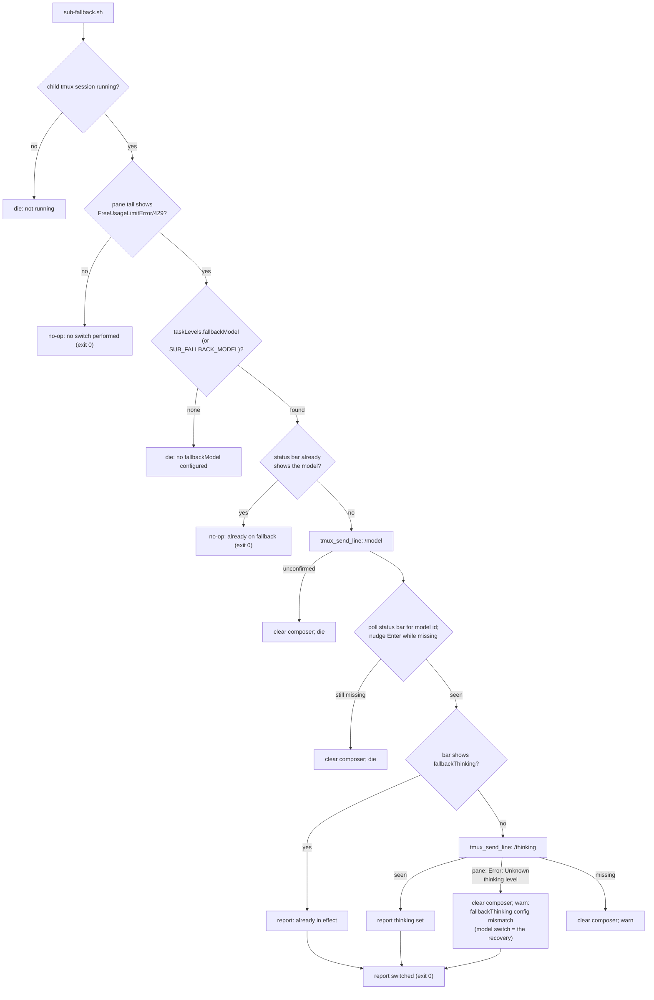

# Design: fallback model for the free provider's usage limit (sub-fallback)

## Summary

The free provider used by the `easy` child level can run out of
quota and answer every request with `FreeUsageLimitError` (HTTP 429), and a
second free-provider rejection wedges a child the same way: pi's
compaction/summarization calls answered with HTTP 403 `FreeTierError`
("free tier can only be used from within OpenCode") block auto-compaction
and leave the child stuck. Pi
classifies that provider error as **terminal** — it retries transient 429s but
deliberately not `FreeUsageLimitError`/`GoUsageLimitError`
(`isTerminalRateLimitError` in pi's provider code) — so the child stops and the
task stalls until a human intervenes.

This change makes the recovery configurable and mechanical:

1. `config.json` gains `taskLevels.fallbackModel` (the model to switch a
   stuck child to) and `taskLevels.fallbackThinking` (the thinking level to
   leave the child on). Sibling of `levels`, same generic-namespace contract:
   unknown keys stay ignored.
2. `scripts/sub-fallback.sh <task>` detects the provider error in the child's
   pane, drives `/model <fallbackModel>` into the running child through the
   shared verified send (`tmux_send_line`), confirms the switch against the pi
   status bar, and leaves the child on `/thinking <fallbackThinking>` when the
   model switch did not already clamp there.
3. It is a **no-op** when the pane shows no free-limit error, when the child
   is already on the fallback model, and when no fallback is configured (the
   latter fails only if an actual error is present and cannot be recovered).

The concrete values live in `config.json` alone (`taskLevels.fallbackModel`
/ `taskLevels.fallbackThinking`) — this document and the tests do not pin
them. Per the user directive (2026-09-29), AGENTS.md names no fallback value
at all; it only points at those entries.

## Stated / deduced / assumed

- **Stated**: config entry in the generic namespace; use the fallback
  automatically when a child hits `FreeUsageLimitError`; must go through the
  verified send; must confirm the switch in the status bar; no-op with a clear
  message without an error; never switch speculatively; graceful degradation
  when the config entry is absent: specs + TDD + shellcheck; AGENTS.md update.
  Follow-up (live test of 2026-09-29, task brief fix-fallback-model-switch):
  the already-on guard must match the status-bar model id **with a boundary**
  (the free id `…-free` contains the fallback id as a substring, which made
  `sub-fallback.sh` no-op while the child stayed stuck); `fallbackThinking`
  must name a level `fallbackModel` accepts, and a rejected level must degrade
  cleanly (model switch = the recovery, thinking mismatch reported as a config
  problem — no warn loop, no success claim); AGENTS.md must be **agnostic**
  about fallback values (user directive): docs point at config.json only.
  Round 3 (task brief fallback-freetier-detect): the detector must also match
  the pane failure observed in production — `Auto-compaction failed: Turn
  prefix summarization failed: 403:` followed by
  `{"type":"FreeTierError",…}` — which wedges the child exactly like the
  429 but no-opped the helper (`no FreeUsageLimitError in …`), forcing a
  manual `/model`. Never speculative must hold: a healthy pane still no-ops,
  the `…-free` id still does not count as "already on", the delimited-token
  status-bar probe is untouched; user-facing messages must describe both
  detected failure kinds; spec + AGENTS.md detection text updated; tests
  extended (403 pane, healthy-pane negative); full suite green; no
  fallback-mechanics redesign. Deduced: the JSON error type sits on its own
  line (the `403:` is on the previous line), so the type name alone is the
  signature — same shape as the existing `FreeUsageLimitError` alternative.
  Assumed: no extra `403 + free-tier wording` alternative — it would repeat
  the speculative-429 audit note without an observed case. Open: none.
- **Deduced** (verified against the installed pi 0.87.1 in scratch tmux panes,
  including a full end-to-end recovery of a really erroring child):
  - `/model <provider/model>` switches a running TUI directly (no picker) and
    echoes `Model: <id>`; the footer (last non-empty line) becomes
    `(<provider>) <model-id> • <thinking>`.
  - `/thinking <level>` validates strictly: `deepseek-v4.1-flash` supports
    `low`, `high`, `max`; `xhigh` is rejected with
    `Error: Unknown thinking level "xhigh"`. `--thinking xhigh` on launch is
    *clamped* to `max` instead, and switching to the model clamps the session's
    current level the same way, so an `xhigh` `standard` child lands on the
    model's clamp with no `/thinking` needed. The shipped pair must stay
    consistent: `fallbackModel = "opencode-go/mimo-v2.6-flash"` accepts
    `off, minimal, low, medium, high` — `max` is rejected with
    `Error: Unknown thinking level "max". Available levels: …` — so
    `fallbackThinking = "high"` keeps that model's ceiling.
  - The status bar renders the free model as `mimo-v2.6-flash-free`: an id
    that **extends** the fallback id `mimo-v2.6-flash` (same alphabet prefix
    + `-free`), so any fixed-substring match on the id confuses the two —
    the exact collision the live test hit.
  - Pi's slash-command argument completion can consume the Enter that
    `tmux_send_line` sends: the pane *reacts* (the popup closes) while the
    command stays in the composer, so the shared helper alone cannot prove
    submission. Observed twice in the live e2e run; the helper therefore
    treats the **status bar** as the ground truth and nudges the verified line
    with bare Enters until it lands.
  - `ctrl+u` is pi's `tui.editor.deleteToLineStart` (keybindings doc), so a
    command that cannot be confirmed can be cleared instead of being left
    parked for an unrelated Enter to submit.
- **Assumed**: operators run the helper from the orchestrator after a child
  reports BLOCKED or after monitoring shows the error; detection is textual
  (see weaknesses) and the helper is explicitly invoked — it is not a daemon.
- **Open**: none blocking.

## Decisions

1. **Config shape** — `taskLevels.fallbackModel` and
   `taskLevels.fallbackThinking`, exactly the shape suggested by the task
   brief, under the existing namespace. `SUB_FALLBACK_MODEL` /
   `SUB_FALLBACK_THINKING` override the config, mirroring
   `SUB_MODEL`/`SUB_THINKING`; `SUB_LEVELS_CONFIG` still relocates the file.
2. **Separate helper, not wired into `sub-status.sh`** — status is read-only
   monitoring; side effects belong to an explicitly invoked script. A separate
   `sub-fallback.sh` keeps each script single-concern (the family's
   convention), lets the recovery be idempotent (`no error`/`already on
   fallback` are no-ops), and means no existing helper reads the fallback
   config at all — degradation is structural.
3. **Detect first, switch second** — the helper refuses to send anything
   unless `pane_has_free_limit_error` matches the free-limit signature in the
   last `FALLBACK_SCAN_LINES` (default 50) lines of the child's pane.
4. **Status bar is the confirmation, the composer is cleaned up** — after
   `tmux_send_line`, the helper polls the footer for the model id and keeps
   nudging Enter while it is missing (`FALLBACK_SEND_ATTEMPTS`); only the
   footer decides success. If a switch still cannot be confirmed, the helper
   clears the composer (`C-u`) and dies — never leaving `/model …` parked for
   a later Enter to submit, and never reporting a switch that did not land.
5. **Thinking is applied only when the model switch did not clamp to it** —
   after the model is confirmed, the footer is checked for
   `fallbackThinking`; if it is already in effect, no command is sent.
   Otherwise `/thinking <level>` is sent and confirmed the same way. The
   thinking step is a refinement, not the recovery: an unconfirmed thinking
   send warns (after clearing the composer) instead of failing a recovered
   child.
6. **Model switch via the verified send** — `tmux_send_line` re-types and
   retries Enter; sending `/model` with a raw `send-keys` races the TUI (both
   probes in this task dropped the first Enter), which is exactly the failure
   the shared helper exists to prevent.
7. **Boundary rule for status-bar model matching** — `pane_shows_model`
   matches the model id as a **delimited token**, never as a substring: the id
   must be preceded by start-of-line or a character outside the model-id
   alphabet `[A-Za-z0-9._-]`, and followed by end-of-line or a character
   outside it (in the real footer the id follows `(provider) ` and is
   followed by ` • level`). `-` and `.` belong to the alphabet, so
   `mimo-v2.6-flash` against a bar showing `mimo-v2.6-flash-free` does **not**
   match (followed by `-`), while the exact id followed by ` •` does. The
   rule distinguishes a strict prefix id in both directions. Note `grep -w`
   is not sufficient: its word alphabet excludes `-`/`.`, so it would still
   match inside `…-free`.
8. **A rejected thinking level degrades to the model recovery** — pi answers
   an invalid `/thinking <level>` with `Error: Unknown thinking level …` in
   the pane (the only channel into the TUI). `confirm_thinking` treats that
   signature as a third outcome (`return 2`): stop polling/nudging, clear the
   composer, and warn that `fallbackThinking` does not match `fallbackModel`
   (a `config.json` problem) — while the already-confirmed `/model` switch
   stands as the recovery, so the helper still exits 0. It never reports the
   level as set and never fail-loops a command the TUI rejected.
9. **AGENTS.md stays value-agnostic** (user directive, 2026-09-29) — the docs
   never name a fallback model or level (no JSON value snippet, no
   "`max` is the top level …" reasoning); they point at the
   `taskLevels.fallbackModel` / `taskLevels.fallbackThinking` entries in
   `config.json` as the single source of truth. (The former [REQ-16] test
   that grepped AGENTS.md for this was removed on 2026-10-03: tests never
   assert document contents.)
10. **Detection covers both free-provider failure kinds; the messages say
    so** (round 3) — `_FALLBACK_ERROR_RE` gains the `FreeTierError` JSON
    type next to `FreeUsageLimitError` and the 429-with-rate-limit-wording
    alternative: one seam, one bounded pane scan, both kinds, no second
    detector. The user-facing strings stop naming only the first kind: the
    no-op path prints "no free-provider failure (FreeUsageLimitError/429,
    FreeTierError/403) in …", and the no-configured-fallback die says
    "free-provider failure detected in …" instead of "free usage limit
    detected" — [REQ-17] detection, [REQ-18] wording. Function names
    (`pane_has_free_limit_error`) stay: "free limit" reads as the family of
    free-provider failures, and renaming would ripple through callers,
    tests, and AGENTS.md for no behavioural gain.

## Entities

- **`config.json`** (modified) — `taskLevels` gains `fallbackModel` and
  `fallbackThinking`; `levels`/`default` unchanged.
- **`scripts/_sub-common.sh`** (modified, new helpers):
  - `resolve_fallback_model` / `resolve_fallback_thinking` — echo the env
    override or the `.taskLevels` value; empty + exit 0 on absent/unreadable/
    malformed config (no warnings — absence is a valid configuration);
  - `pane_last_line <task>` — last non-empty line of the task's pane (pi's
    status bar), empty when the session is not running;
  - `pane_has_free_limit_error <task> [lines]` — pane-tail match against
    either free-provider failure: `FreeUsageLimitError` (HTTP 429 quota) or
    `FreeTierError` (HTTP 403 free-tier rejection), or an HTTP 429 next to
    rate-limit wording (decision 10);
  - `pane_shows_model <task> <model>` — status-bar match on the model id
    (pi renders the part after the final `/`), as a delimited token per
    decision 7 (a strict prefix id does not collide);
  - `pane_shows_thinking <task> <level>` — status-bar match on the level after
    pi's `•` bullet (`off` renders as `• thinking off`);
  - `pane_thinking_level_rejected <task> [lines]` — pane-tail match on
    `Error: Unknown thinking level`, pi's answer to a `fallbackThinking` the
    model in effect does not accept (decision 8).
- **`scripts/sub-fallback.sh`** (recovery flow above, with
  `confirm_model`/`confirm_thinking` (poll + Enter nudge; `confirm_thinking`
  also returns 2 on a pane rejection, decision 8) and
  `clear_composer`; exits 0 on no-op/success — including the degraded
  "model switched, thinking rejected" outcome —, dies loudly when the model
  switch itself cannot be confirmed.
- **`specs/free-limit-fallback/`** (new) — this design + the feature file.
- **`tests/free-limit-fallback.test.sh`** (new) — one test per
  `[REQ-2]`…`[REQ-18]` (gaps where scenarios were removed) plus a
  supplementary popup-swallow regression, fake-tmux sandbox (no real
  session touched). Resolver tests and `setup()` use fixture configs; the
  shipped root `config.json` is never the subject under test.
- **`AGENTS.md`** — "Child model and thinking levels" section documents the
  fallback entries and the helper, value-agnostically (decision 9, [REQ-16]).

## Behaviour and data flow

## Proposed changes (files/modules)

| File | Change |
|---|---|
| `config.json` | `taskLevels.fallbackModel` + `taskLevels.fallbackThinking`, kept consistent with each other |
| `scripts/_sub-common.sh` | fallback resolvers + pane helpers (last line, error detection, model/thinking probes) |
| `scripts/sub-fallback.sh` | new helper: detect → verified switch → status-bar confirm (no-op otherwise) |
| `specs/free-limit-fallback/*` | feature file + this design |
| `tests/free-limit-fallback.test.sh` | behavioural suite, one test per scenario + popup regression |
| `AGENTS.md` | document the fallback entry and the recovery command, value-agnostically (point at config.json) |
| `tests/task-levels.test.sh` | make executable (pre-existing 0644; the rest of `tests/*.sh` is 0755) |

## Task list

- [x] Deduce atomic requirements from the brief → [REQ-1]…[REQ-13]
- [x] Verify pi behaviour empirically (footer format, `/model` direct switch,
      `/thinking` validation/clamping, Enter races, completion popup) in
      scratch tmux panes
- [x] Write the feature file and this design doc
- [x] RED: run the new suite against the unchanged tree
- [x] GREEN: implement config + helpers + helper script; suite passes
- [x] Real end-to-end recovery: a live child stuck on the 429 switched to
      deepseek-v4.1-flash @ max, re-running the helper is a no-op
- [x] Popup-swallow hardening (status-bar confirmation + Enter nudge + C-u
      cleanup) with a fake-tmux regression
- [x] Full suite (`tests/*.sh`) green, shellcheck clean
- [x] AGENTS.md section updated
- [x] Code audit pass (below)
- [x] Round 2 (fix-fallback-model-switch): specs for [REQ-14]…[REQ-16]
      written first, then the three regressions RED (prefix-collision no-op,
      shipped-value drift, stale `fallbackThinking`) → GREEN
- [x] Full suite green + shellcheck after round 2
- [x] Code audit pass, round 2 (below)
- [x] Round 3 (fallback-freetier-detect): specs for [REQ-17]/[REQ-18] written
      first → RED (403/`FreeTierError` pane undetected, single-kind no-op
      message) → GREEN (regex alternative + message rewording, decision 10)
- [x] Full suite green + shellcheck after round 3 — including the sync of
      `tests/task-levels.test.sh`, `specs/child-task-levels/*`, and the
      AGENTS.md level table to config retune 565bd68 (red on development
      before this task: that commit retuned config.json without updating
      its pinned expectations)
- [x] Code audit pass, round 3 (below)

## Strengths / Weaknesses

- **Strengths**: recovery is configuration, not code; the helper is a deep
  module (one positional arg hides detection, idempotence, verified delivery,
  status-bar confirmation, and composer cleanup); existing helpers are
  untouched, so a missing/broken fallback entry cannot affect spawning; the
  switch reuses the same verified send seam as every other child instruction;
  every failure path is explicit about what was and was not changed.
- **Weaknesses**:
  1. Detection is textual: a pane that *quotes* the exact error signature
     (e.g. while reading the brief of this very task) could false-positive.
     Mitigated by the tail window and by the helper being operator-invoked on
     a child that is actually stuck; a false positive is reversible with
     another `/model`.
  2. The status-bar probes are fixed-string matches on pi's rendered footer
     (model id after the final `/` — now as a delimited token per decision 7 —
     level after `•`). A relabelled or truncated footer (very long model id)
     would make confirmation fail even though the switch took effect — the
     loud failure, not a wrong success.
  3. `fallbackThinking` is model-specific (a level `fallbackModel` accepts);
     changing `fallbackModel` without adjusting it is now *detected* at
     runtime: pi's rejection degrades to a config-problem warning while the
     model switch recovers the child (decision 8). Residual edge: a stale
     `Error: Unknown thinking level` left in the 50-line pane tail could make
     a later, legitimate `/thinking` send read as rejected — the outcome is a
     conservative warn instead of a claim, and any subsequent run re-checks
     the status bar first.
  4. The Enter nudge and the `C-u` cleanup assume pi's default editor
     keybindings (`enter` submits, `ctrl+u` deletes to line start); a
     rebinding in the child's keybindings.json would weaken the nudge (the
     status-bar confirmation still fails loudly).
  5. The helper only recovers a *running* child; a child that already exited
     on the error needs a normal respawn/recovery, out of scope here.

## Code audit (post-implementation, independent pass)

Audited per the `codebase-design` deep-module vocabulary: the feature file and
the changed source files were read from disk, ignoring the conversational
rationale above.

- **Overview**: `sub-fallback.sh` is the external seam — one positional
  argument, and four observable outcomes (no-op / already-on-fallback /
  switched / loud failure), with detection, verified delivery, status-bar
  confirmation, and composer cleanup hidden behind `_sub-common.sh` helpers.
  Those helpers are the internal seams the tests cross directly
  ([REQ-1]…[REQ-4], [REQ-7]): resolvers are pure config reads
  (env-overridable), the pane probes take only `(task, …)` and touch nothing
  but tmux. `confirm_model`/`confirm_thinking` are deliberately local to
  `sub-fallback.sh`: no other caller needs them, and the fake-tmux test
  exercises them through the script's interface. The spec's [REQ-n] chain
  stayed 1:1 with the test cases through implementation (12→13 after the
  thinking behavior was split into its own atomic requirement), with the
  popup-swallow regression carried as a supplementary test.
- **Files**: `scripts/_sub-common.sh` (`resolve_fallback_*`,
  `pane_last_line`, `pane_has_free_limit_error`, `pane_shows_model`,
  `pane_shows_thinking`), `scripts/sub-fallback.sh`, `config.json`.
- **Problem / Solution / Benefits**: no major improvement detected. The
  deletion test holds: removing `sub-fallback.sh` would push the
  detect→send→confirm→cleanup sequence into the orchestrator's manual tmux
  commands, which is exactly the fragile interaction this helper replaces.
- **Less valuable improvements** (noted, deliberately not done):
  1. The 429 alternative in `_FALLBACK_ERROR_RE` overlaps the primary
     `FreeUsageLimitError` signature — a generalisation for sibling free/Go
     limit failures, not dead code; its value is speculative until a
     non-`FreeUsageLimitError` case shows up.
  2. `confirm_model`/`confirm_thinking` are near-duplicates differing only in
     the probe function; a parameterised `confirm <probe> <value>` would
     remove the pair, at the cost of an eval/indirect call in shell. *Worth
     exploring* if a third confirmed switch appears; today the duplication is
     two small, readable loops.
  3. The probe timeout/delay are env-tunable (`FALLBACK_PROBE_*`,
     `FALLBACK_SEND_ATTEMPTS`) but undocumented in AGENTS.md; they are test
     hooks first, tuning knobs second.
- **Recommendation strength**: Speculative for all three; audit verdict — no
  architectural friction detected, ship it.

## Code audit, round 2 (fix-fallback-model-switch, post-implementation)

Independent pass per the `code-auditor` skill: the feature file and the
changed sources (`scripts/_sub-common.sh`, `scripts/sub-fallback.sh`,
`config.json`, `AGENTS.md`) were read from disk, ignoring the conversational
rationale above.

- **Overview**: round 2 kept the seam deep. `sub-fallback.sh` still takes one
  positional argument; the externally visible outcomes grew from four to five
  (no-op / already-on / switched / switched+thinking-rejected-warn / loud
  failure), and the caller still learns them through one `case $t_rc` fork
  over a documented tri-state `confirm_thinking` (0 set, 2 rejected, 1
  unconfirmed) — no pane internals leaked to the caller. The boundary rule
  (decision 7) landed entirely inside `pane_shows_model`, so every caller —
  the already-on guard *and* `confirm_model` — got the fix for free; the new
  `pane_thinking_level_rejected` + `_FALLBACK_THINKING_ERROR_RE` mirror the
  existing `pane_has_free_limit_error` + `_FALLBACK_ERROR_RE` shape, so the
  probe vocabulary stayed uniform. The [REQ-n] chain stayed 1:1 with the
  tests (17 scenarios ↔ 17 test cases, [REQ-14]…[REQ-16] added at both ends
  of the chain).
- **Files**: `scripts/_sub-common.sh` (`pane_shows_model`,
  `pane_thinking_level_rejected`), `scripts/sub-fallback.sh`
  (`confirm_thinking`, the thinking-outcome block), `config.json`,
  `AGENTS.md`, plus specs/tests.
- **Problem / Solution / Benefits**: no friction found — the two bug fixes
  are behaviour corrections inside existing seams, not new structure; the
  deletion test still holds (removing the helpers would push token matching
  and rejection triage back into each caller).
- **Less valuable improvements** (noted, deliberately not done):
  1. `confirm_model`/`confirm_thinking` remain near-duplicates;
     `confirm_thinking` now carries the extra rejection probe, widening the
     gap. A parameterised `confirm <probe> <extra-probe> <value>` would merge
     them at the cost of an indirect call in shell — *worth exploring* only
     if a third confirmed switch appears.
  2. `pane_shows_thinking` is still a fixed `• <level>` substring match with
     no delimiter rule. No pair in pi's current level set collides (no level
     is a strict prefix of another, and `• high` is not a substring of
     `• xhigh`), so the model-id fix was not generalized speculatively;
     apply the same token rule if pi ever gains a colliding level.
  3. The rejection signature is scanned in the same fixed 50-line tail as the
     free-limit error; a stale `Error: Unknown thinking level` line can only
     cause a conservative warn (never a false success) — recorded under
     weaknesses 3 instead of adding tail-since-send bookkeeping.
- **Recommendation strength**: Speculative for all three; audit verdict — no
  architectural friction detected, ship it.

## Code audit, round 3 (fallback-freetier-detect, post-implementation)

Independent pass per the `code-auditor` skill: the feature file and the
changed sources (`scripts/_sub-common.sh`, `scripts/sub-fallback.sh`,
`AGENTS.md`, plus the `child-task-levels` sync artifacts) were re-read from
disk, ignoring the conversational rationale above.

- **Overview**: the change landed entirely inside the existing seam.
  Detection grew one alternative arm in `_FALLBACK_ERROR_RE` — the single
  internal seam every caller shares — so `sub-fallback.sh`'s detect gate and
  both tests picked up the 403/`FreeTierError` kind without touching their
  structure; `pane_shows_model` (delimited token), the already-on guard, and
  the send/confirm flow have **no diff**, so "never speculative" and the
  status-bar semantics are preserved structurally, not just by test. The two
  user-facing strings that describe detection (no-op info, no-fallback die)
  were reworded; the messages that do not name failure kinds (already-on,
  switched, loud failure) were correctly left alone. The [REQ-n] chain stayed
  1:1 with the tests: 18 scenarios ↔ 18 `run` lines, plus the one
  supplementary popup regression.
- **Files**: `scripts/_sub-common.sh` (`_FALLBACK_ERROR_RE` + comments),
  `scripts/sub-fallback.sh` (header, no-op info, no-fallback die),
  `specs/free-limit-fallback/*`, `tests/free-limit-fallback.test.sh`
  (`seed_free_tier_error`, `t_req17_*`, `t_req18_*`), `AGENTS.md`; second
  commit: `tests/task-levels.test.sh`, `specs/child-task-levels/*`,
  AGENTS.md level table (sync to config retune 565bd68).
- **Problem / Solution / Benefits**: no friction found — the detector is a
  flat signature list in one constant; adding a kind is one arm plus one
  fixture, and the deletion test still holds (removing the seam pushes the
  scan into every caller). The `child-task-levels` sync is expectation
  follow-up to the user's own config retune, zero behaviour change.
- **Less valuable improvements** (noted, deliberately not done):
  1. The no-op message hardcodes the two signatures as prose next to a
     regex that encodes them — two places that must move together when a
     third kind appears. Deriving the message from one shared list would
     couple them, at the cost of shell string-building for a human-readable
     line; today both names are pinned by [REQ-18]'s test, so drift of the
     *existing* kinds is caught.
  2. `pane_has_free_limit_error` now detects a free-*tier* rejection as
     well as the usage limit; a `pane_has_provider_failure` alias would
     match the new message vocabulary but ripples through callers, tests,
     and AGENTS.md for zero behaviour gain (decision 10). *Worth exploring*
     only if the family gains a kind the word "limit" cannot stretch to.
  3. No `403 + free-tier wording` alternative was added alongside the
     `FreeTierError` type name — a generalisation with no observed case,
     exactly the speculative-value note from round 1.
- **Recommendation strength**: Speculative for all three; audit verdict — no
  architectural friction detected, ship it.

## Change: document/config-content assertions removed (2026-10-03)

User directive: tests never assert the contents of a document or a config
file. The suite used to pin the shipped `config.json` fallback pair
([REQ-1] echo, and the pane tests' `SUB_LEVELS_CONFIG="$ROOT/config.json"`)
and to grep `AGENTS.md` for the fallback wording ([REQ-12], [REQ-16]) — all
red once the shipped config was retuned.

- [REQ-1], [REQ-12], [REQ-16] scenarios + tests removed.
- Resolver tests now use a fixture under `$SCRATCH`/`$SB`; `setup()` writes
  `$SB/fixture-config.json` (`fallbackModel = opencode-go/mimo-v2.6-flash`,
  `fallbackThinking = high`) and points `SUB_LEVELS_CONFIG` at it. The free
  status-bar id still extends the fixture fallback id, so the [REQ-14]
  prefix-collision regression survives future `config.json` retunes.
- The pane-test behaviour ([REQ-2]…[REQ-18] minus the removed labels) is
  unchanged and still covered.

Disposition recorded in `specs/no-doc-config-tests/no-doc-config-tests-design.md`.
