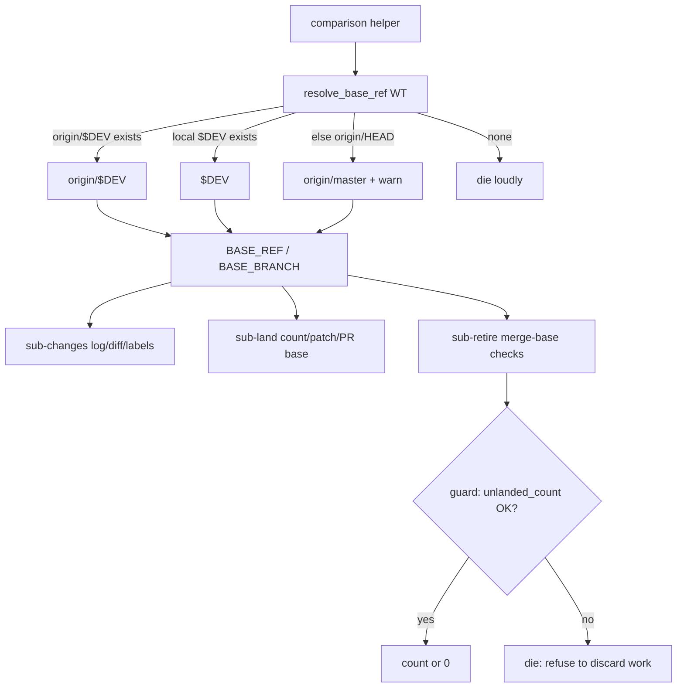

# Design: comparison helpers share the base-branch fallback

## Summary

PR #32 gave the *spawn* path a shared base resolver,
`resolve_base_ref <repo>` ([`scripts/_sub-common.sh`](file://scripts/_sub-common.sh)):
`origin/$DEV_BRANCH` → local `$DEV_BRANCH` → the `origin/HEAD` default → die
loudly. It deliberately left the comparison helpers out of scope, so with
`development` deleted [`scripts/sub-changes.sh`](file://scripts/sub-changes.sh),
[`scripts/sub-land.sh`](file://scripts/sub-land.sh) and
[`scripts/sub-retire.sh`](file://scripts/sub-retire.sh) still interpolate
`$DEV_BRANCH` raw and die on `git log development..HEAD` (exit 128).

This change routes every base comparison in those three helpers through
`resolve_base_ref`, and extracts the unlanded-count computation into a shared,
testable helper so sub-retire's safety guard is **correct by construction**:
an unresolvable base or an uncomputable range aborts loudly instead of
silently reading as "0 unlanded commits".

## Entities

- **[`scripts/_sub-common.sh`](file://scripts/_sub-common.sh) (modified)** —
  keep `resolve_base_ref` (PR #32) as the single base seam (it already warns
  on fallback). Add `unlanded_count <repo> <base-ref>`: echoes `git log
  <base>..HEAD`'s commit count, or fails (non-zero, no output) when the range
  cannot be computed. It never masks git's failure behind `wc -l`, so its
  correctness does not depend on `pipefail`.
- **[`scripts/sub-changes.sh`](file://scripts/sub-changes.sh) (modified)** —
  resolve `BASE_REF`/`BASE_BRANCH` and use them for the commits list,
  diff-stat and labels.
- **[`scripts/sub-land.sh`](file://scripts/sub-land.sh) (modified)** — same
  base seam for the unlanded count (via `unlanded_count`), the commit list,
  the rescue patch and the `gh pr create --base` instruction.
- **[`scripts/sub-retire.sh`](file://scripts/sub-retire.sh) (modified)** —
  resolve the base once up front (loud on failure), use it in
  `is_published`, `remote_merged`, `cleanup_branches` and the
  unpublished-work guard, and compute the guard's count through
  `unlanded_count` under an explicit failure check.
- **[`specs/helpers-base-fallback/`](file://specs/helpers-base-fallback/) (new)** —
  this design + the feature file ([REQ-1]…[REQ-8]).
- **[`tests/helpers-base-fallback.test.sh`](file://tests/helpers-base-fallback.test.sh) (new)** —
  hermetic fixtures: unit tests for the shared helpers plus end-to-end runs of
  the three scripts with fake `treehouse`/`tmux`/`gh`.

## Behaviour and data flow

```
BASE_REF    = resolve_base_ref <worktree>      # origin/$DEV, $DEV, or origin/HEAD default
BASE_BRANCH = ${BASE_REF#origin/}              # display / gh --base / refs/heads lookups

sub-changes : git log/diff "$BASE_REF"..HEAD   + labels "$BASE_BRANCH"
sub-land    : unlanded_count "$WT" "$BASE_REF" + gh pr create --base "$BASE_BRANCH"
sub-retire  : BASE_REF in merge-base checks; UNLANDED = unlanded_count … || die
```



## The guard, correct by construction

Current guard (unsafe without `pipefail`):

```bash
UNLANDED=$(git -C "$WT" log --oneline "$DEV_BRANCH"..HEAD | wc -l)
```

`git log` is piped into `wc -l`, so a missing base makes `UNLANDED=0` unless
`pipefail` happens to abort first. The replacement captures git's output
first and checks its status explicitly:

```bash
if ! UNLANDED=$(unlanded_count "$WT" "$BASE_REF"); then
  die "cannot count commits not on '$BASE_REF' — refusing to discard work blindly"
fi
```

`unlanded_count`'s only pipeline-free failure path is the `if !` around the
command substitution, so "cannot compute" can never be confused with "0".

## Plan

1. Add `unlanded_count` to `_sub-common.sh` beside `resolve_base_ref`.
2. `sub-changes.sh`: resolve the base, substitute `BASE_REF`/`BASE_BRANCH`.
3. `sub-land.sh`: resolve the base, substitute everywhere, count via
   `unlanded_count` with an explicit failure `die`.
4. `sub-retire.sh`: resolve the base once after the worktree/branch are
   captured; thread `BASE_REF`/`BASE_BRANCH` through `is_published`,
   `remote_merged`, `cleanup_branches` and the safety guard.
5. Add `tests/helpers-base-fallback.test.sh` (one test per scenario).
6. Update the base-branch prose in `AGENTS.md` to drop the "comparison
   helpers are out of scope" caveat.

## Proposed changes

| File | Change |
| --- | --- |
| `scripts/_sub-common.sh` | `+ unlanded_count` |
| `scripts/sub-changes.sh` | resolved base for log/diff/labels |
| `scripts/sub-land.sh` | resolved base for count/log/patch/PR base |
| `scripts/sub-retire.sh` | resolved base + pipefail-independent guard |
| `tests/helpers-base-fallback.test.sh` | new suite, `[REQ-1]`…`[REQ-8]` |
| `specs/helpers-base-fallback/` | new feature + design |
| `AGENTS.md` | comparison-helper fallback prose |

## Best practices

- **One seam for base choice**: the precedence rule already lives in
  `resolve_base_ref`; the helpers only strip `origin/` for display, so the
  rule cannot drift between callers.
- **Safety logic is a testable seam**: `unlanded_count` isolates the
  "count or fail" decision from `sub-retire`'s surrounding flow, so the
  pipefail-independence property can be tested directly.
- **Reuse over invention**: `branch_exists`, `warn`, `info`, `die` and
  `resolve_base_ref` are reused; no new dependency is introduced.
- **Fail loud, never guess**: an unresolvable base aborts before any worktree
  mutation, so a retirement can never discard work on a guessed range.

## Decision strengths and weaknesses

- **Strengths**: minimal surface change; the fallback rule has exactly one
  home; the retirement guard no longer relies on `pipefail`; all three
  helpers report the same warning the spawn path does.
- **Weaknesses**: resolving the base *unconditionally* in sub-retire means a
  repository with no `origin/HEAD` and no configured branch cannot be retired
  even with `--force`; that is the intended "abort loudly" trade-off, and it
  only affects a repository with no usable base at all. The on-base-branch and
  detached-HEAD cases keep their pre-existing `UNLANDED=0` shortcut, so the
  guard's new strength is scoped to task branches based on the resolved base.

## Audit note (code-auditor)

Independent pass over the feature file and the modified `_sub-common.sh`,
`sub-changes.sh`, `sub-land.sh` and `sub-retire.sh` (tests and this design
excluded). No **Strong** findings; the deep-module seams hold:

- `resolve_base_ref` stays the single owner of base precedence and the
  fallback warning; the helpers only strip `origin/` for display, so no
  caller re-derives the fallback rule (the failure mode #32's audit fixed in
  the spawn path).
- `unlanded_count` is a genuinely deep helper: a one-line interface hides the
  "count or fail" decision, and that decision is the one the safety guard
  needs — the four touched call sites no longer carry `git log | wc -l`
  semantics, so pipefail-independence is a property of the module, not of the
  process's shell options.
- `cleanup_branches`/`is_published`/`remote_merged` reconstruct the remote
  counterpart as `origin/$BASE_BRANCH`; that is the publication question
  ("reachable from a remote"), distinct from base precedence, so it is not a
  locality leak of the resolver.

Remaining, **Speculative** only: (1) `BASE_REF=$(resolve_base_ref …);
BASE_BRANCH=${BASE_REF#origin/}` is repeated in four scripts — a
`resolve_base` that echoes both could remove it, but it would add a second
seam and process substitution for a two-line saving. (2) the dirty-work
count `git status --porcelain | wc -l` in the same guard still relies on
pipefail if `git status` itself fails; unlike the base ref that can only
happen in an already-broken worktree, so it is left as-is (the requirement
scopes the by-construction guarantee to the base ref).
