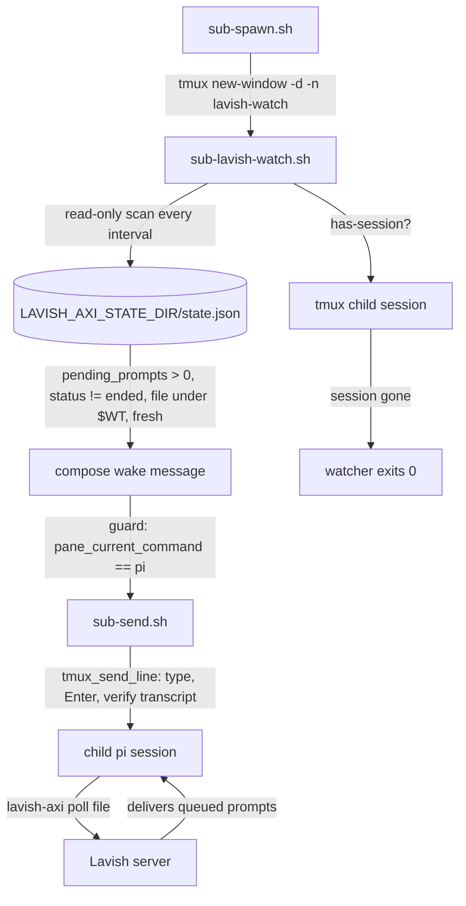

# Design: sub-lavish-watch — wake a child when Lavish feedback is queued

## Abstract

A child that opens a Lavish artifact and goes idle has no poll listener, so
browser feedback stays queued in the Lavish server's state file
(`pending_prompts`) and only a manual `sub-send.sh … "poll"` gets it moving.
The fix adds one supervisor-owned watcher per child,
[`scripts/sub-lavish-watch.sh`](file://scripts/sub-lavish-watch.sh), armed by
[`scripts/sub-spawn.sh`](file://scripts/sub-spawn.sh) in a dedicated
`lavish-watch` window of the child's tmux session. The watcher reads the
Lavish state file (`$LAVISH_AXI_STATE_DIR/state.json`, read-only), selects
sessions whose artifact is under the child's leased worktree and whose
`pending_prompts > 0`, and wakes the child through the existing verified send
(`sub-send.sh` → `tmux_send_line`). It never polls and never consumes
feedback: the child drains its own queue with `lavish-axi poll`, exactly as
before. Wakes are deduplicated per queued batch, failed sends are retried
with backoff, non-`pi` panes are never typed into, and the watcher exits when
the child session disappears (retirement kills the session, so the watcher
dies with it).

## Entities and seams

- [`scripts/sub-lavish-watch.sh`](file://scripts/sub-lavish-watch.sh)
  **(new)** — the watcher loop and its two seams:
  - `lavish_pending_sessions <state-file> <wt> <since>` — pure read of the
    Lavish state; emits the pending-session JSON (key, file, count, prompts)
    for the child's worktree.
  - `compose_wake_message` — formats the one-line wake from that JSON.
  Everything else (state path, intervals, tick bound) is environment-driven
  so tests can sandbox it.
- [`scripts/sub-spawn.sh`](file://scripts/sub-spawn.sh) **(modified)** —
  after the kickoff is confirmed, creates the watcher window
  (`tmux new-window -d -t =$SESS: -n lavish-watch -c $WT "exec …"`),
  prints a `watch:` handle, warns when the window cannot be created, and
  honors `SUB_SPAWN_NO_WATCH=1`. Best effort: a missing watcher never fails
  the spawn.
- [`scripts/_sub-common.sh`](file://scripts/_sub-common.sh) **(unchanged)** —
  `wt_for_task`, `session_of`, `tmux_send_line`, `info`/`warn` are reused as
  they are.
- Reused seams: `sub-send.sh` (the only send path; keeps the
  `tmux_send_line` verification rules in one place), the Lavish CLI state
  file (read-only), and the child's own `lavish-axi poll` flow (delivery).
- [`specs/lavish-wake/`](file://specs/lavish-wake/) **(new)** — this design +
  the feature file ([REQ-1]…[REQ-14]).
- [`tests/lavish-wake.test.sh`](file://tests/lavish-wake.test.sh) **(new)** —
  one test per scenario, hermetic (fake `treehouse`/`tmux`/`lavish-axi`,
  fixture state files, bounded ticks).
- [`AGENTS.md`](file://AGENTS.md) **(modified)** — a short operational note
  under the Lavish reviews section.

## Behaviour and data flow



Wake decision per scan:

```
pending = sessions(status != ended)
          where pending_prompts > 0
          and updated_at >= watcher start − margin
          and file starts with "$WT/"
signature = JSON of pending
if pending empty:        forget (the child drained the queue)
elif signature changed:  wake once (after retry backoff, if the last attempt failed)
else (same batch):       wake again only after the re-wake interval
```

## Plan

1. Add `scripts/sub-lavish-watch.sh`: `main` guarded by
   `BASH_SOURCE == $0`, so tests can source the pure helpers; loop over
   `tmux has-session` → scan → dedupe → guarded verified wake → bounded
   ticks/interval.
2. Wire it into `sub-spawn.sh` as a detached `lavish-watch` window
   (best-effort, `watch:` handle, `SUB_SPAWN_NO_WATCH=1` opt-out).
3. Add `tests/lavish-wake.test.sh`: fake tmux/treehouse/lavish-axi and
   fixture state files; one test per scenario `[REQ-1]`…`[REQ-14]`.
4. Document the convention in `AGENTS.md`.

## Proposed changes

| File | Change |
| --- | --- |
| `scripts/sub-lavish-watch.sh` | new watcher (scan, dedupe, guarded verified wake, exit) |
| `scripts/sub-spawn.sh` | arm the watcher window, report it, warn on failure |
| `tests/lavish-wake.test.sh` | new suite, `[REQ-1]`…`[REQ-14]` |
| `specs/lavish-wake/` | new feature + design |
| `AGENTS.md` | short child-wake-up note |

## Constant values

- watcher scan interval `LAVISH_WATCH_INTERVAL` = 2 s
- failed-wake retry `LAVISH_WATCH_RETRY_SECONDS` = 5 s
- unchanged-batch re-wake `LAVISH_WATCH_REWAKE_SECONDS` = 60 s
- watcher start margin `LAVISH_WATCH_START_MARGIN` = 60 s
- state dir `LAVISH_AXI_STATE_DIR` (default `$HOME/.lavish-axi`)
- test tick bound `LAVISH_WATCH_TICKS` (0 = run until the session dies)

## Best practices

- **Loss-free by construction**: the watcher is a read-only observer. It
  never runs `lavish-axi poll`, so it cannot consume a prompt the child never
  received; undelivered feedback simply stays queued and the watcher retries.
- **One send path**: every typed instruction still goes through
  `sub-send.sh`/`tmux_send_line` (type, separate Enter, verify against the
  transcript), so the fix-send-confirm rules apply unchanged.
- **Supervisor-owned listener is not needed**: Lavish's own guidance allows a
  supervisor-owned process listener, but not holding one keeps the child's
  normal foreground poll authoritative and removes every
  `LISTENER_ACTIVE`/`--takeover` conflict.
- **Ownership is the worktree**: the leased worktree is already the child's
  identity (`wt_for_task`), so filtering artifacts by path needs no new
  registry. The start-time margin guards against sessions left open by a
  previous user of a pooled worktree.
- **Deduped, bounded retries**: one wake per queued batch, bounded re-wake,
  backoff after a failed verified send; a pane that is not running pi is
  never typed into.
- **Lifecycle by tmux**: the watcher lives in a window of the child's own
  session, so `sub-retire.sh`'s `tmux kill-session` is the single stop
  switch; no PID files, no pkill.
- **Testable seams**: the scan and message composition are pure functions of
  the state file, and all timing/paths are environment-driven.

## Audit note (code-auditor)

The independent pass over the feature file and the modified
`sub-lavish-watch.sh` / `sub-spawn.sh` found one locality/robustness leak
and it was fixed in place:

- A transiently unreadable state file (the Lavish server rewrites it
  non-atomically) was treated as "queue empty", which reset the dedupe state
  and could re-wake the same queued batch on the next successful read. The
  failed scan now keeps the previous batch signature and attempt time, so
  dedupe survives the gap; `[REQ-7]` was extended with the unreadable scan
  and the test was verified RED against the pre-fix watcher (2 wakes) and
  GREEN after (1 wake).

No other findings of note. The remaining candidates are **Speculative**:
hoisting the `pane_current_command == pi` guard into `sub-send.sh` (would
change manual-send behaviour, out of scope), and dialing the wake-message
contents for multi-artifact rounds (the current wording already lists every
artifact).

## Decision strengths and weaknesses

- **Strengths**: no new dependencies (jq/tmux already required); zero risk to
  the main session's `lavish-telegram` wake path (untouched); feedback can
  never be lost; the child keeps its documented `lavish-axi poll` flow; the
  watcher is invisible to the child until there is actually something to do.
- **Weaknesses**: feedback wakes the child indirectly — the child must act on
  the wake and run `lavish-axi poll`, so a child that ignores wake messages
  stalls (the same failure mode as today's manual instruction, now
  automatic). A prompt that is queued and consumed between two scans may
  still produce a harmless extra wake. The watcher depends on the Lavish
  state schema (`pending_prompts`, `status`, `file`, `updated_at`), which is
  handled defensively: an unreadable or reshaped state is skipped, never a
  failed wake or a lost batch.
