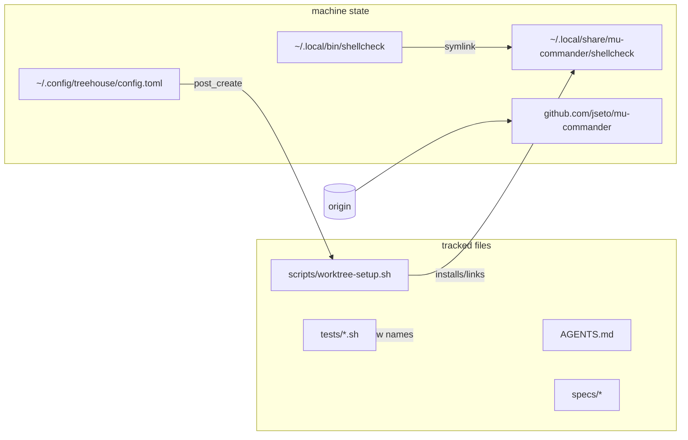

# Design: rename the project identifier to mu-commander

History: this spec was written for the first rename step
(`ai-orchestrator` → `ai-commander`, PR #10). The follow-up task finished the
rename to **mu-commander**, so this document — like the whole tree — now names
the project `mu-commander`; the old identifiers appear only where they define
what was renamed. The follow-up's own spec/design/test pair lives in
`specs/rename-mu-commander/` and `tests/rename-mu-commander.test.sh`.

## Stated / deduced / assumed

- **Stated (original brief):** rename the hyphenated identifier
  `ai-orchestrator` and its derivations everywhere in tracked files; keep
  generic "orchestrator"/"orchestration" prose; two machine-level fixes
  (treehouse hook path, managed shellcheck directory); GitHub repo rename +
  origin update before push/PR; full test suite green; standard child flow.
- **Stated (follow-up):** PR #10 was squash-merged into `development`
  (`cd236ce`), re-applying the intermediate `ai-commander` identifiers and
  re-adding `specs/rename-ai-commander/*` plus `tests/rename-project.test.sh`.
  The final tree must name the project `mu-commander` everywhere, so the
  identifiers inside these newly added files were updated too; conflicts
  were resolved keeping everything newer from `development`.
- **Deduced:** the `~/.local/bin/shellcheck` symlink points into the managed
  directory, so moving the directory without re-pointing the symlink would
  leave a dangling link and a broken `command -v shellcheck`; the move must
  include re-pointing the symlink for [REQ-4] to hold.
- **Deduced:** the machine-level holders are renamed by the orchestrator
  *after* the checkout-folder rename, so the machine scenarios cannot be
  satisfied while the folder is still `ai-commander`. [REQ-4]/[REQ-5] are
  therefore evaluated only once the mu-commander state exists (checked via
  the managed dir / checkout path) and skip until then.
- **Assumed:** no other machine state outside the repo references the old
  identifier in a way this task must fix; the exact follow-up list lives in
  `specs/rename-mu-commander/rename-mu-commander-design.md`.
- **Open questions:** none — both briefs were explicit; no user input
  required (the interactive `question` tool is not available in this
  session).

## Entities

| Entity | Change |
|---|---|
| Tracked identifiers `ai-orchestrator` / `ai-commander` | → `mu-commander` (AGENTS.md ×2, scripts/worktree-setup.sh, specs, tests/worktree-setup.test.sh) |
| Rename documents | `specs/rename-ai-commander/*` kept as history and updated to the final name; `specs/rename-mu-commander/*` added by the follow-up |
| Test suites | `tests/rename-project.test.sh` (machine-state half, updated) + `tests/rename-mu-commander.test.sh` (tracked-file half, new) |
| `pi.sh` default session ([REQ-2]) | dropped: development removed `pi.sh` in favour of the `mu` launcher; its coverage (`tests/test-pi-sh.sh`) went with it |
| `~/.config/treehouse/config.toml` | post_create hook path → `/home/jseto/programming-projects/mu-commander/scripts/worktree-setup.sh` (machine, after the folder rename) |
| `~/.local/share/ai-orchestrator\|ai-commander/shellcheck` | `mv` → `~/.local/share/mu-commander/shellcheck` + re-point `~/.local/bin/shellcheck` (machine, after the folder rename) |
| GitHub repo / origin | `jseto/ai-orchestrator` → `jseto/ai-commander` (PR #10) → `jseto/mu-commander` (follow-up; origin re-pointed) |

## Seams

## Plan (TDD order)

1. Write `tests/rename-project.test.sh` and update the assertions in
   `tests/worktree-setup.test.sh` first → suite RED (they assert the new
   names while code still has the old ones).
2. Apply the tracked-file renames → [REQ-1]/[REQ-3] go green.
3. Machine fixes (treehouse hook, shellcheck move + symlink re-point),
   applied by the orchestrator after the folder rename → [REQ-4]/[REQ-5]
   go green.
4. GitHub rename + origin URL → [REQ-7] green; then push and open the PR.
5. Full suite green, commit, report.

Follow-up completion (this branch, after the PR #10 squash merge): rebase
onto `origin/development`, resolve the `ai-commander` ↔ `mu-commander`
conflicts in favour of `mu-commander` while keeping every newer development
change, update `specs/rename-ai-commander/*` and
`tests/rename-project.test.sh` to the final name, re-run the full suite,
force-push.

`tests/rename-project.test.sh` guards machine-specific assertions: they skip
(not fail) when the config/managed dir/remote does not exist, or while the
mu-commander checkout is not yet in place, so the suite stays runnable on
machines without this task's machine state.

## Best practices / decisions

- **grep over `git ls-files`** for [REQ-1]: only tracked files count;
  gitignored scratch (`tmp/`) and history stay untouched by design. The
  rename's own spec/test documents are exempt from the grep (pathspec
  excludes): they must literally name the old identifiers to define the
  rename — a stale-reference check that flagged its own definition would be
  self-defeating. Both rename doc folders and both suites are exempt so the
  checks stay green whichever branch/merge order brought them in.
- **Guarded machine assertions** keep the suite hermetic while still failing
  loudly on *this* machine when a fix regresses (e.g. hook pointing back at
  the old directory). The [REQ-4]/[REQ-5] guards key off the mu-commander
  managed dir / checkout, the two things the post-folder-rename step creates.
- **Symlink re-point instead of re-install**: preserves the pinned,
  checksummed binary — no network, no re-download, idempotency check passes.
- **Weakness:** the suite cannot prove the remote GitHub repo name itself
  (only the configured origin URL); the `gh repo rename` steps were verified
  at execution time (`gh repo view jseto/mu-commander`) and are recorded in
  the reports.

## Out of scope (explicitly preserved)

`.git`, gitignored scratch, historical records (`logs/conversations/`,
`~/.pi/agent/sessions/`, `.pi/`), and every prose use of
"orchestrator"/"orchestration" describing the role rather than the project.

## Code audit (post-implementation, code-auditor skill)

- **Overview**: sources re-read from disk (`*.feature` + modified sources,
  design doc excluded from the audit input). The change is a value-only
  substitution along existing seams — no new modules, no behavior change
  beyond the identifier, so no major architectural improvements were
  detected and the audit stopped at step 2. One scenario↔test gap was found
  and fixed: REQ-4's "no re-download" clause now has an automated assertion
  (the test runs `worktree-setup.sh` and requires the "already installed"
  line and the absence of "installing pinned").
- **Files**: `scripts/worktree-setup.sh:120`, `AGENTS.md:123,240`,
  `specs/*-design.md` documents, `tests/worktree-setup.test.sh`, new
  `tests/rename-project.test.sh`.
- **Less valuable improvements (not taken, deliberately)**: splitting the
  machine-state assertions ([REQ-4]/[REQ-5]) into a separate suite runnable
  only on the provisioning host (speculative — they already skip
  gracefully); asserting the GitHub repo *name* rather than the origin URL
  (would add a network dependency to the suite; verified once at execution
  time instead).
- **Tests**: full suite green after the change (9/9 files at PR #10 time).

### Rebase audit (PR #10 onto current `development`)

- **Conflicts**: `AGENTS.md` auto-merged (development's newer prose plus the
  two identifier paths); `pi.sh`,
  `specs/pi-sh-tmux-wrapper/pi-sh-tmux-wrapper-design.md` and
  `tests/test-pi-sh.sh` were modify/delete conflicts and resolved to
  **deleted** — development dropped `pi.sh` in favour of the `mu.sh`
  launcher (#11/#12), so the branch's edits to those files are obsolete.
- **Verification**: the branch delta vs `development` was exactly the
  identifier substitutions in the surviving files plus this spec/test pair;
  no development content was reverted, no later rename identifier was
  introduced, and the generic "orchestrator"/"orchestration" prose is
  untouched.
- **[REQ-2] is historical**: its `pi.sh` default no longer exists on the
  rebased base and its coverage (`tests/test-pi-sh.sh`) was removed by
  development; this spec now records the requirement as dropped.
- **[REQ-7] pinned to the actual repository state**: the GitHub repository
  was renamed again to `jseto/mu-commander` by the follow-up task, so the
  origin assertion (test and feature wording) expects the current name while
  still failing on either earlier identifier.
- No architectural findings; the change remains a value-only substitution
  along existing seams.

### Follow-up audit (final mu-commander rebase)

- **Conflicts**: the follow-up rebase conflicted on the five
  identifier-only lines that PR #10 had converted to `ai-commander`
  (`AGENTS.md` ×2, `scripts/worktree-setup.sh`,
  `specs/branch-cleanup-retire/…`, `specs/shellcheck-in-repo/…`,
  `tests/worktree-setup.test.sh`). All were resolved to `mu-commander`;
  every other (newer) development change was kept, nothing was reverted.
- **Newly merged files updated**: `specs/rename-ai-commander/*` and
  `tests/rename-project.test.sh` now name the project `mu-commander`
  throughout — [REQ-1] greps for both earlier identifiers, [REQ-3]/[REQ-4]
  use the mu-commander shellcheck path, [REQ-5] the mu-commander checkout,
  and [REQ-7] the actual remote
  `https://github.com/jseto/mu-commander.git` with both old identifiers
  rejected. [REQ-4]/[REQ-5] remain guarded on the post-folder-rename machine
  state.
- **No new architectural findings**: still a pure identifier substitution
  across prose, one shell path constant and the test suites.
