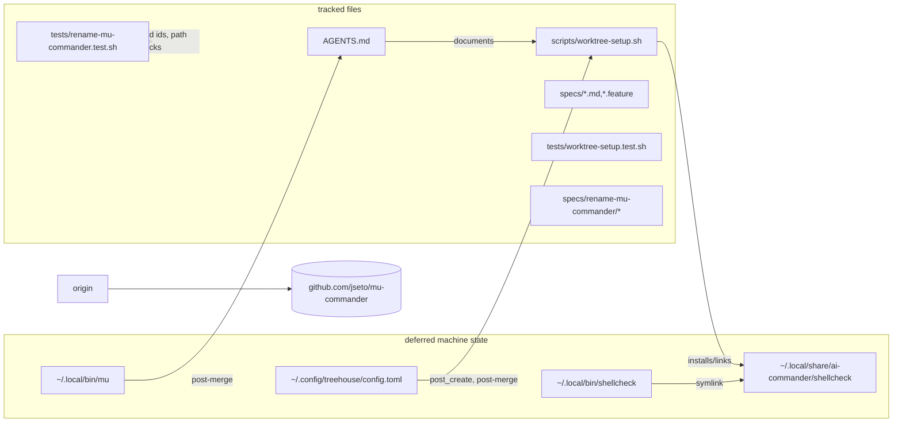

# Design: rename the project to mu-commander

## Stated / deduced / assumed

- **Stated (brief):** rename the project identifier to `mu-commander`
  everywhere in tracked files. Both old identifiers — `ai-orchestrator` and
  `ai-commander` — must become `mu-commander`, including derivations
  (`repos/jseto/*`, `$XDG_DATA_HOME/*/shellcheck`, checkout paths under
  `/home/jseto/programming-projects/*`). Keep generic
  "orchestrator"/"orchestration" prose, do not touch machine state (folder
  rename, `~/.local/bin/mu`, `~/.config/treehouse/config.toml`) — the
  orchestrator does that after all children finish — rename the GitHub
  repository and update `origin` before pushing, run the full suite green,
  standard child flow.
- **Stated (follow-up):** PR #10 was squash-merged into `development`
  (`cd236ce`) while this task ran, re-applying the intermediate
  `ai-commander` identifiers and adding `specs/rename-ai-commander/*` plus
  `tests/rename-project.test.sh`; the branch was rebased, conflicts resolved
  to `mu-commander` keeping every newer development change, and the newly
  added files updated to the final name.
- **Deduced:** in-repo absolute paths must be written as if the folder were
  already `/home/jseto/programming-projects/mu-commander`, because that is
  where the checkout lands; the GitHub repo rename is safe to do from this
  worktree (the `gh` CLI resolves `jseto/ai-commander` today and keeps a
  redirect afterwards), so `origin` can be re-pointed before the push.
- **Deduced:** `tests/rename-project.test.sh` and `specs/rename-ai-commander/`
  legitimately name the old identifiers (they define the rename), so the
  identifier grep must exempt them; after the PR #10 merge they are part of
  the tree and were updated to the mu-commander end state here.
- **Assumed:** no machine-level state outside the repo is fixed by this
  child; the changed paths on this machine are exactly
  `~/.config/treehouse/config.toml` (post_create), `~/.local/bin/mu` (PATH
  symlink → `mu.sh`), `~/.local/bin/shellcheck` (symlink into the managed
  directory) and `~/.local/share/ai-commander/shellcheck` — all listed as
  post-merge follow-ups below.
- **Open questions:** none — the brief is explicit and the interactive
  `question` tool is not available in this session.

## Entities

| Entity | Change |
|---|---|
| `AGENTS.md:123,240` | hook path + `SCRIPTS` path → `/home/jseto/programming-projects/mu-commander/...` |
| `scripts/worktree-setup.sh:120` | `SHELLCHECK_MANAGED` → `${XDG_DATA_HOME:-$HOME/.local/share}/mu-commander/shellcheck` |
| `tests/worktree-setup.test.sh:31` | sandbox `MANAGED` → `.../.local/share/mu-commander/shellcheck` |
| `specs/branch-cleanup-retire/branch-cleanup-retire-design.md:31` | `repos/jseto/ai-orchestrator` → `repos/jseto/mu-commander` |
| `specs/shellcheck-in-repo/shellcheck-in-repo-design.md:25` | `$XDG_DATA_HOME/ai-orchestrator/...` → `.../mu-commander/...` |
| `specs/child-task-levels/child-task-levels.feature:5` | "ai-commander checkout" → "mu-commander checkout" |
| `specs/mu-launcher/mu-launcher-design.md:51` | checkout path → `.../mu-commander/mu` (identifier only; PR #14's `mu.sh`→`mu` rename merged and the conflict resolved to both changes) |
| `specs/rename-mu-commander/` (new) | this design + `rename-mu-commander.feature` |
| `tests/rename-mu-commander.test.sh` (new) | one assertion block per `[REQ-n]` |
| `specs/rename-ai-commander/*` (post-merge, PR #10) | identifiers updated to the final name; machine scenarios keep the post-folder-rename guards |
| `tests/rename-project.test.sh` (post-merge, PR #10) | updated: greps both old identifiers, mu-commander machine paths, actual origin remote |
| GitHub repo + `origin` | `gh repo rename mu-commander -R jseto/ai-commander --yes`, then `git remote set-url origin https://github.com/jseto/mu-commander.git` |

## Seams



## Plan (TDD order)

1. Write `tests/rename-mu-commander.test.sh` (+ the feature/design docs) →
   suite is RED against the current tree (old identifiers still present).
2. Apply the tracked-file renames → `[REQ-1]` and `[REQ-3]` go green.
3. Rename the GitHub repo, re-point `origin`, then push and open the PR →
   `[REQ-6]` green.
4. Full `tests/*.sh` suite green + shellcheck clean, commit, report.
5. Follow-up (PR #10 squash-merged as `cd236ce`): rebase onto
   `origin/development`, resolve the `ai-commander` ↔ `mu-commander`
   conflicts to `mu-commander` keeping every newer development change,
   update `specs/rename-ai-commander/*` + `tests/rename-project.test.sh`
   to the final name, re-run the full suite, force-push.

## Decisions / best practices

- **grep over `git ls-files`-equivalent** for [REQ-1]: only tracked files and
  paths count; gitignored scratch (`tmp/`), history (`logs/conversations/`,
  `~/.pi/agent/sessions/`) and `.git` metadata stay untouched by design.
- **Exemptions are path-scoped and documented**: `specs/rename-mu-commander/`,
  `tests/rename-mu-commander.test.sh`, the earlier `specs/rename-ai-commander/`
  and `tests/rename-project.test.sh` must literally name the old identifiers
  to define the renames; a stale-reference check that flagged its own
  definition would be self-defeating. The earlier docs (now merged into the
  tree) are exempt too and were updated to the same final state, so the
  exemption documents rename history rather than tolerating stale text.
- **The shared `mu-launcher-design.md` line merges both changes**: PR #14
  (`mu.sh` → `mu`) touched the same line as this rename; the rebase resolved
  it to `/home/jseto/programming-projects/mu-commander/mu`. Only the
  identifier substring was ever changed on this branch, so the conflict was
  mechanical.
- **Machine-level fixes stay out of this PR** by explicit instruction: the
  report carries the `ACTION-POST-MERGE` list for the orchestrator to run
  after the folder rename. The suite therefore does not assert machine state
  (an assertion would pass only on this host and would go red the moment the
  orchestrator applies the follow-ups).
- **Weakness:** the suite can only assert the configured `origin` URL, not
  the repository name on GitHub itself; `gh repo rename` was verified once
  at execution time (`gh repo view jseto/mu-commander`) and is recorded in
  the report.

## Machine-level follow-ups (for the orchestrator, after the folder rename)

```text
ACTION-POST-MERGE:
- ~/.config/treehouse/config.toml: post_create -> /home/jseto/programming-projects/mu-commander/scripts/worktree-setup.sh
- ~/.local/bin/mu -> /home/jseto/programming-projects/mu-commander/mu   (PR #14 has landed, so the target file is `mu`)
- ~/.local/share/ai-commander/shellcheck -> ~/.local/share/mu-commander/shellcheck   (exists on this machine; ai-orchestrator does not)
- ~/.local/bin/shellcheck -> re-point into ~/.local/share/mu-commander/shellcheck/v<pin>/shellcheck after the move
- ~/.config/treehouse config and ~/.local/bin/mu currently live on this machine; verify the orchestrator's own list once more before running
```

## Out of scope (explicitly preserved)

`.git`, gitignored scratch, historical records
(`logs/conversations/`, `~/.pi/agent/sessions/`, `.pi/`), every prose use of
"orchestrator"/"orchestration" describing the role rather than the project,
and all machine-level state (applied by the orchestrator after the folder
rename, per the list above).

## Code audit (post-implementation, code-auditor skill)

- **Overview**: the audited sources were re-read from disk (`rename-mu-commander.feature`
  plus the modified sources; the design doc and tests excluded from the audit input).
  The change is a value-only substitution along existing seams — no new modules,
  no behavior change beyond the identifier. Evaluating against `codebase-design`
  found no major improvements: depth/interface of `worktree-setup.sh` is
  unchanged (the managed path stays one internal constant), and AGENTS.md/specs
  edits are prose. The audit stopped at step 2; no refactor was performed.
- **Files**: `AGENTS.md:123,240`, `scripts/worktree-setup.sh:120`, four
  `specs/*-design.md|*.feature` documents, `tests/worktree-setup.test.sh`,
  new `specs/rename-mu-commander/` and `tests/rename-mu-commander.test.sh`,
  plus (after the PR #10 merge) `specs/rename-ai-commander/*` and
  `tests/rename-project.test.sh`.
- **Less valuable improvements (not taken, deliberately)**: the managed root
  (`mu-commander/shellcheck`) is written twice — once in the setup script, once
  in the worktree-setup test sandbox — but the duplication is intentional: the
  test asserts the expected literal instead of deriving it from the
  implementation under test. The behavioral exemption is exercised by
  `[REQ-1]` whenever the exempt files are present.
- **Tests**: full suite green after the change (11/11 `tests/*.sh` files,
  including both rename suites and the updated worktree-setup sandbox path).
