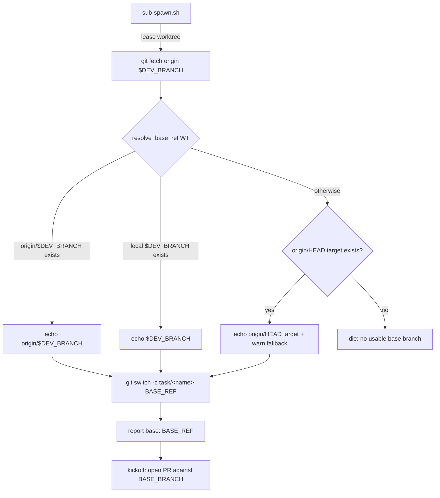

# Design: spawn base-branch fallback (sub-spawn)

## Summary

`sub-spawn.sh` bases a new `task/<name>` branch on the configured
`$DEV_BRANCH` ("development"). Today it fetches `origin/$DEV_BRANCH`, uses
`origin/$DEV_BRANCH` when that ref exists, else the local `$DEV_BRANCH`, and
otherwise fails — `git switch -c … development` dies when the repository has
deleted `development` (local and remote), even though `AGENTS.md` already
documents the intended fallback ("use the default branch" when development is
gone).

The fix extracts base selection into one shared helper, `resolve_base_ref`,
and makes `sub-spawn.sh` call it:

```
base ref = origin/$DEV_BRANCH            (remote ref exists — fetch failure is irrelevant)
           else local $DEV_BRANCH        (local branch exists)
           else origin/HEAD's target     (fallback: the repository default branch)
           else die loudly               (never silently guess a base)
```

The chosen ref is reported in the spawn handles, a fallback warns, and the
child's kickoff names the resolved base branch (so the pull request opens
against the branch the work was actually cut from).

**Scope:** only the spawn path. The comparison helpers (`sub-changes.sh`,
`sub-land.sh`, `sub-retire.sh`) keep using `$DEV_BRANCH` exactly as before —
no other `sub-*` helper's behaviour changes.

## Entities

- **[`scripts/_sub-common.sh`](file://scripts/_sub-common.sh) (modified)** —
  new `resolve_base_ref <repo-root>`: echoes the ref to base a task branch
  on, dies when none exists. Reuses the existing `branch_exists` helper; never
  fetches (fetching stays the caller's step, so pre-existing remote-tracking
  refs keep priority even when the fetch fails).
- **[`scripts/sub-spawn.sh`](file://scripts/sub-spawn.sh) (modified)** — keeps
  the `git fetch origin "$DEV_BRANCH"` attempt, replaces the inline
  `origin/$DEV_BRANCH` / `$DEV_BRANCH` if-else with `resolve_base_ref`;
  derives `BASE_BRANCH` (ref minus a leading `origin/`), warns on fallback,
  prints `base:` in the handles, and uses `$BASE_BRANCH` in the kickoff's
  pull-request instruction.
- **[`specs/spawn-base-fallback/`](file://specs/spawn-base-fallback/) (new)** —
  this design + the feature file ([REQ-1]…[REQ-8]).
- **[`tests/spawn-base-fallback.test.sh`](file://tests/spawn-base-fallback.test.sh) (new)** —
  resolver tests against a hermetic fixture git repo, plus end-to-end
  `sub-spawn.sh` tests with fake `treehouse`/`tmux` binaries first on `PATH`.
- **[`AGENTS.md`](file://AGENTS.md) (modified)** — the base-branch prose, the
  `DEV_BRANCH` override bullet, and the spawn/PR prose now describe the
  fallback.

## Behaviour and data flow



## Plan

1. Add `resolve_base_ref` to `_sub-common.sh` next to `branch_exists`; pure
   ref lookup, no fetch, warns on fallback, dies on none.
2. In `sub-spawn.sh`, after the fetch, resolve `BASE_REF` and print the base
   in the handles.
3. Thread `BASE_BRANCH=${BASE_REF#origin/}` into the kickoff.
4. Add `tests/spawn-base-fallback.test.sh` (one test per scenario).
5. Update the base-branch prose in `AGENTS.md`.

## Proposed changes

| File | Change |
| --- | --- |
| `scripts/_sub-common.sh` | `+ resolve_base_ref` |
| `scripts/sub-spawn.sh` | fetch → resolve → warn → report → kickoff base |
| `tests/spawn-base-fallback.test.sh` | new suite, `[REQ-1]`…`[REQ-8]` |
| `specs/spawn-base-fallback/` | new feature + design |
| `AGENTS.md` | base-branch fallback prose |

## Best practices

- **One seam for base selection**: the decision lives in a single named
  helper instead of an inline if-else, so the spawn script reads as
  "fallback happens here" and the rule is testable in isolation.
- **Pure resolver**: it only reads refs. The fetch stays in the caller, which
  is what keeps "an existing remote ref wins even when the fetch fails"
  (REQ-7) true by construction — the resolver cannot observe a failed fetch.
- **Fail loud, never guess**: with neither the configured branch nor
  `origin/HEAD`, spending work on a guessed base is avoided; the existing
  EXIT trap releases the lease instead.
- **Reuse**: `branch_exists` and the existing `warn`/`info`/`die` helpers.

## Decision strengths and weaknesses

- **Strengths**: minimal, local change; the comparison helpers are untouched
  per the requirement; the operator sees the actual base; the child's PR base
  can no longer disagree with the branch it was cut from.
- **Weaknesses**: `origin/HEAD` is the only fallback source — a repository
  with a remote but no `origin/HEAD` and no configured branch still fails
  loudly (intended: no silent guessing). The comparison helpers will keep
  naming `development` when a repository has abandoned it; that is existing
  behaviour, explicitly out of scope here.

## Audit note (code-auditor)

The independent pass over the feature and the modified `_sub-common.sh` /
`sub-spawn.sh` found one locality leak and it was fixed in place:

- The resolver's fallback was reported by a caller-side predicate
  (`BASE_REF != origin/$DEV_BRANCH && BASE_REF != $DEV_BRANCH`) that
  duplicated the resolver's own precedence knowledge and mis-detected a
  remote-qualified `DEV_BRANCH`. The warning now lives inside
  `resolve_base_ref`, so the fallback rule and its reporting are one module
  and the caller just uses the echoed ref. No other friction of note; the
  remaining items are **Speculative** (e.g. teaching the comparison helpers
the fallback), which the requirement explicitly excludes.
